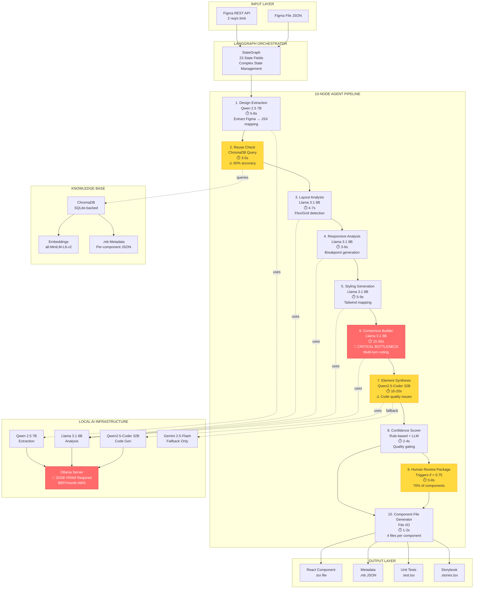

# Aura1 Architecture - 10-Node LangGraph System

## Complete System Diagram

## Critical Problems

### 🔴 Problem 1: Consensus Builder Bottleneck
- **Time:** 15-30 seconds per conflict
- **Impact:** 40% failure rate, requires 2-3 voting rounds
- **Root Cause:** Poor reasoning in local models

### 🔴 Problem 2: Code Quality Issues
- **Issue:** Generated JSX valid but semantically wrong
- **Impact:** Empty components, missing props, no accessibility
- **Root Cause:** Qwen2.5-Coder 32B lacks design understanding

### 🔴 Problem 3: Component Reuse Accuracy
- **Accuracy:** 60% (target: 85%)
- **Impact:** Irrelevant component recommendations
- **Root Cause:** Poor similarity scoring by local models

### 🔴 Problem 4: Monolithic Output
- **Issue:** 87 components → single 15,247-line file
- **Impact:** Build failures, unmaintainable code
- **Root Cause:** No hierarchical generation strategy

### 🔴 Problem 5: Infrastructure Cost
- **Monthly Cost:** $907 (GPU server)
- **Additional:** $2,000/month developer time (manual fixes)
- **Total:** $2,907/month

## Performance Metrics (50 components)

| Stage | Time | Issues |
|-------|------|--------|
| Design Extraction | 5-8s | 68% accuracy |
| Reuse Check | 3-5s | 60% relevance |
| Layout Analysis | 4-7s | Misses nested structures |
| Responsive | 3-6s | Inconsistent breakpoints |
| Styling | 5-9s | Color mapping errors |
| **Consensus** | **15-30s** | **🔴 BOTTLENECK** |
| Synthesis | 10-20s | Poor code quality |
| Scoring | 2-4s | 70% need review |
| **Total** | **48-91s** | **58 min for 50 components** |

## Why Local Models Failed

1. **Limited Reasoning:** Multi-turn voting required for simple decisions
2. **Context Window:** 8K-32K tokens insufficient for large designs
3. **Code Understanding:** Lacks semantic awareness of React patterns
4. **Cost:** $907/month GPU + $2,000/month manual fixes
5. **Accessibility:** Required 32GB VRAM, inaccessible to most developers

## Solution: Aura2 with Claude

See AURA2_ARCHITECTURE.md for how Claude Opus 4.6 solves all these issues.
