# Aura2 — Complete Architecture Diagrams

> **Project:** Aura2 — AI-Powered Figma → React Converter
> **Stack:** FastAPI · Claude Agent SDK (Opus 4.6) · React 18 · TypeScript · ChromaDB · SQLite
> **Context:** Samsung PRISM @ IIIT Naya Raipur

---

## Table of Contents

1. [System Overview](#1-system-overview)
2. [Tech Stack Map](#2-tech-stack-map)
3. [End-to-End Data Flow](#3-end-to-end-data-flow)
4. [Conversion Pipeline — 5 Steps](#4-conversion-pipeline--5-steps)
5. [Backend Architecture](#5-backend-architecture)
6. [Frontend Architecture](#6-frontend-architecture)
7. [MCP Server Integration](#7-mcp-server-integration)
8. [Database & Storage Schema](#8-database--storage-schema)
9. [API Endpoints Map](#9-api-endpoints-map)
10. [RAG Component Reuse System](#10-rag-component-reuse-system)
11. [Visual Verification Loop](#11-visual-verification-loop)
12. [Deployment Pipeline](#12-deployment-pipeline)
13. [Component Relationships (Class Diagram)](#13-component-relationships-class-diagram)
14. [Full Conversion Sequence Diagram](#14-full-conversion-sequence-diagram)
15. [Performance Benchmarks](#15-performance-benchmarks)
16. [Environment Configuration Map](#16-environment-configuration-map)

---

## 1. System Overview

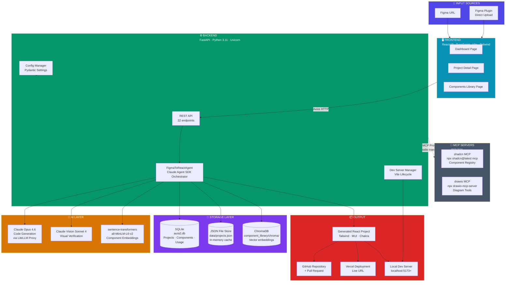

---

## 2. Tech Stack Map

```mermaid
mindmap
  root((Aura2<br/>Tech Stack))
    Frontend
      React 18.2
      TypeScript 5.2
      Vite 5.0.8
        HMR
        Fast Build
      Tailwind CSS 3.3.6
      shadcn/ui
        Primitives
        Radix UI base
      TanStack Query 5.17
        Server state
        Polling
      React Router 6.20
      Framer Motion 11.18
        Animations
      Axios 1.6
      Lucide Icons 0.294
    Backend
      FastAPI 0.109
      Python 3.11+
      Uvicorn
        ASGI server
      Pydantic v2.5
        Data validation
        Settings
      SQLAlchemy async
        ORM
      aiosqlite
        Async SQLite
      aiofiles
        Async file I/O
      httpx 0.26
      anyio 4.2
    AI & ML
      Claude Agent SDK 0.1
        Tool orchestration
        max_turns=35
      Anthropic API 0.40
        Claude Opus 4.6
          Code generation
          Design analysis
          Prompt: ~8k tokens
        Claude Sonnet 4
          Vision comparison
          Screenshot diff
      LiteLLM Proxy
        API key routing
        Model aliasing
      sentence-transformers 2.2
        all-MiniLM-L6-v2
        384-dim vectors
    Storage
      SQLite
        projects table
        components table
        component_usage table
      ChromaDB 1.4
        Persistent store
        Cosine similarity
        Threshold 60%
      JSON File Store
        projects.json
        Thread-safe Lock
        In-memory cache
    Browser Automation
      Playwright 1.57
        Full-page screenshots
        Dev server testing
        Headless Chromium
      Pillow 10
        Image processing
        Diff generation
    Code Quality
      ESLint
        TS rules
        React rules
      Prettier
        Auto-format
      npm CLI
        install
        run build
        run dev
    MCP Servers
      shadcn MCP
        list_items
        search_items
        get_add_command
        view_items
      drawio MCP
        create_diagram
        edit_diagram
    External APIs
      Figma REST API
        GET /files/{key}
        GET /images/{key}
        Rate limiting handled
      GitHub API
        Repo creation
        Branch push
        PR creation
      Vercel API
        v13/deployments
        Auto-deploy
        Live URL
    Templates
      react-tailwind
        Primary template
        Vite + Tailwind
      react-mui
        Material-UI
      react-chakra
        Chakra UI
```

---

## 3. End-to-End Data Flow

```mermaid
flowchart LR
    A([👤 User]) --> B{Input Type}

    B -- "Figma URL" --> C[figma_api.py<br/>Fetch design tree<br/>from REST API]
    B -- "Plugin Upload" --> D[plugin_conversion.py<br/>Direct plugin data<br/>bypasses rate limits]

    C --> E[figma_extraction.py<br/>Parse node hierarchy<br/>frames · groups · text]
    D --> E

    E --> F[design_styles.py<br/>Colors · Fonts<br/>Effects · Shadows]
    E --> G[responsive_extraction.py<br/>Breakpoints<br/>Responsive rules]

    F --> H[Normalized<br/>Design JSON]
    G --> H

    H --> I{RAG Search<br/>component_store.py<br/>ChromaDB}
    I -- "similarity ≥ 60%" --> J[Reuse existing<br/>component code]
    I -- "no match" --> K[Flag for new<br/>generation]

    J --> L[prompt_generation.py<br/>Build Claude prompt<br/>with design context<br/>+ reusable components]
    K --> L

    L --> M[Claude Opus 4.6<br/>Agent SDK<br/>max_agent_turns=35]
    M --> N[React + TypeScript<br/>+ Tailwind CSS code]

    N --> O[semantic_analysis.py<br/>ARIA attributes<br/>AST analysis]
    O --> P[accessibility.py<br/>WCAG 2.1 AA<br/>contrast · alt text]

    P --> Q[project_setup.py<br/>Scaffold from template<br/>react-tailwind / mui / chakra]

    Q --> R[Visual Verification Loop<br/>verification.py]
    R --> S[Playwright<br/>Capture screenshot]
    S --> T[vision_comparison.py<br/>Claude Vision API<br/>diff analysis]
    T --> U{confidence<br/>≥ 98%?}
    U -- "No<br/>max 10 iters" --> V[auto_fix_agent.py<br/>Generate targeted fixes<br/>Claude Opus]
    V --> W[fix_applicator.py<br/>Apply code patches]
    W --> R
    U -- "Yes" --> X[build_verifier.py<br/>npm run build<br/>TypeScript check]

    X --> Y[code_quality.py<br/>ESLint + Prettier<br/>auto-format]
    Y --> Z[component_store.py<br/>Store new components<br/>in ChromaDB]
    Z --> AA[project_store.py<br/>Update status: success<br/>Save to JSON + SQLite]

    AA --> AB{Deploy?}
    AB -- "GitHub" --> AC[git_manager.py<br/>Create repo + push<br/>+ optional PR]
    AB -- "Vercel" --> AD[Vercel API<br/>auto-deploy<br/>get live URL]
    AB -- "Local" --> AE[dev_server_manager.py<br/>localhost:5173+]

    AC --> AF([✅ Done])
    AD --> AF
    AE --> AF

    style A fill:#4f46e5,color:#fff
    style M fill:#d97706,color:#fff
    style T fill:#d97706,color:#fff
    style AF fill:#059669,color:#fff
```

---

## 4. Conversion Pipeline — 5 Steps

```mermaid
flowchart TD
    START([▶ FigmaToReactAgent.convert]) --> S1

    subgraph S1["📐 STEP 1 — Design Extraction"]
        S1A[figma_api.py<br/>Fetch Figma file tree<br/>via REST API token]
        S1B[figma_extraction.py<br/>Parse node hierarchy<br/>frames · groups · components · text]
        S1C[design_styles.py<br/>Extract: colors · fonts<br/>effects · box-shadows · opacity]
        S1D[responsive_extraction.py<br/>Extract breakpoints<br/>& responsive layout rules]
        S1E[figma_screenshot.py<br/>Download design screenshots<br/>for visual reference]
        S1A --> S1B --> S1C --> S1D --> S1E
    end

    subgraph S2["🔍 STEP 2 — RAG Component Reuse"]
        S2A[sentence-transformers<br/>all-MiniLM-L6-v2<br/>Generate 384-dim query embedding]
        S2B[ChromaDB cosine search<br/>collection: react_components<br/>Top-K neighbors]
        S2C{Similarity<br/>threshold?}
        S2D["reuse_directly<br/>> 90% match<br/>Return as-is"]
        S2E["adapt<br/>70–90% match<br/>Modify for context"]
        S2F["create_new<br/>< 60% match<br/>Generate fresh"]
        S2A --> S2B --> S2C
        S2C -- "> 90%" --> S2D
        S2C -- "70–90%" --> S2E
        S2C -- "< 60%" --> S2F
    end

    subgraph S3["🤖 STEP 3 — Claude Code Generation"]
        S3A[prompt_generation.py<br/>Build: system prompt<br/>+ design JSON<br/>+ reusable component context]
        S3B[Claude Agent SDK<br/>claude-opus-4-6<br/>max_turns=35<br/>max_fix_turns=15]
        S3C[semantic_analysis.py<br/>AST analysis<br/>Add ARIA roles · labels<br/>Semantic HTML mapping]
        S3D[accessibility.py<br/>WCAG 2.1 AA compliance<br/>Contrast ratios · alt text<br/>Keyboard navigation]
        S3A --> S3B --> S3C --> S3D
    end

    subgraph S4["👁️ STEP 4 — Visual Verification Loop"]
        S4A[project_setup.py<br/>Scaffold project from template<br/>npm install]
        S4B[dev_server_manager.py<br/>Start Vite: localhost:5173<br/>Wait for health check]
        S4C[Playwright<br/>Full-page screenshot<br/>headless Chromium]
        S4D[vision_comparison.py<br/>Claude Vision Sonnet 4<br/>Compare Figma vs Generated<br/>Output: confidence + discrepancies]
        S4E{Confidence<br/>≥ 98%?}
        S4F[auto_fix_agent.py<br/>Claude Opus 4.6<br/>Generate targeted code fixes<br/>for each discrepancy]
        S4G[fix_applicator.py<br/>Apply patches to<br/>component source files]
        S4H[fix_tracker.py<br/>Track fix history<br/>Prevent fix loops]
        S4I{Iter ≥ 10?}
        S4A --> S4B --> S4C --> S4D --> S4E
        S4E -- "No" --> S4F --> S4G --> S4H --> S4I
        S4I -- "No" --> S4C
        S4I -- "Yes, force stop" --> NEXT4
        S4E -- "Yes ✅" --> NEXT4
    end

    subgraph S5["🏗️ STEP 5 — Build & Quality Check"]
        S5A[build_verifier.py<br/>npm run build<br/>TypeScript compile check]
        S5B[code_quality.py<br/>ESLint auto-fix<br/>Prettier format]
        S5C[component_store.py<br/>Embed + store new components<br/>in ChromaDB for future reuse]
        S5D[project_store.py<br/>Update project: status=success<br/>Save metrics to JSON + SQLite]
        S5A --> S5B --> S5C --> S5D
    end

    S1D --> S2A
    S2D & S2E & S2F --> S3A
    S3D --> S4A
    NEXT4[→] --> S5A
    S5D --> DONE([✅ Project Ready<br/>generated_projects/])

    style S1 fill:#dbeafe,stroke:#3b82f6,color:#1e40af
    style S2 fill:#fef3c7,stroke:#f59e0b,color:#78350f
    style S3 fill:#dcfce7,stroke:#22c55e,color:#14532d
    style S4 fill:#fce7f3,stroke:#ec4899,color:#831843
    style S5 fill:#ede9fe,stroke:#8b5cf6,color:#4c1d95
    style START fill:#1e293b,color:#fff
    style DONE fill:#059669,color:#fff
```

---

## 5. Backend Architecture

```mermaid
graph TB
    subgraph ENTRY["🚪 Entry — main.py (FastAPI 0.109)"]
        MAIN["FastAPI App<br/>22 REST endpoints<br/>CORS · Background Tasks<br/>Static file mount: /projects"]
    end

    subgraph CFG["⚙️ Config"]
        CONFIG["config.py<br/>Settings (Pydantic BaseSettings)<br/>Reads from .env<br/>All tokens + thresholds"]
        DSM["dev_server_manager.py<br/>Vite dev server lifecycle<br/>Port allocation: 5173–6000<br/>Process tracking"]
    end

    subgraph AGENTS["🤖 agents/"]
        FTR["figma_to_react.py<br/>FigmaToReactAgent<br/>Main orchestrator<br/>Claude Agent SDK"]
        CA["component_analyzer.py<br/>Component analysis utilities"]

        subgraph AGENT_SUB["agents/_figma_to_react/ — Pipeline Steps"]
            FA["figma_api.py<br/>Figma REST API client<br/>File fetch · Image export"]
            FE["figma_extraction.py<br/>Node tree parser<br/>Hierarchy traversal"]
            DS["design_styles.py<br/>Style extractor<br/>Colors · Fonts · Effects"]
            RE["responsive_extraction.py<br/>Breakpoint extractor<br/>Responsive rules"]
            PC["plugin_conversion.py<br/>Plugin data → Design JSON<br/>Bypasses Figma rate limits"]
            PS["project_setup.py<br/>Template → Project scaffold<br/>react-tailwind / mui / chakra"]
            PG["prompt_generation.py<br/>Claude prompt builder<br/>System + User + Context"]
            SA["semantic_analysis.py<br/>AST-based semantic mapping<br/>ARIA role assignment"]
            VE["verification.py<br/>Verification loop controller<br/>max_iterations=10"]
        end
    end

    subgraph UTILS["🔧 utils/ — 15 Utility Modules"]
        AC["accessibility.py<br/>WCAG 2.1 AA compliance<br/>Contrast · Alt text · ARIA"]
        AF["auto_fix_agent.py<br/>AI-powered fix generator<br/>Claude Opus · targeted patches"]
        BV["build_verifier.py<br/>npm install + build<br/>TypeScript validation"]
        CQ["code_quality.py<br/>ESLint + Prettier<br/>Auto-fix + format"]
        CM["component_matcher.py<br/>Similarity matching<br/>Threshold scoring"]
        CL_LOG["conversion_logger.py<br/>Progress logging<br/>Step tracking"]
        FRL["figma_rate_limiter.py<br/>Figma API rate limiting<br/>Request throttling"]
        FSS["figma_screenshot.py<br/>Figma design screenshots<br/>Node image export"]
        FIX["fix_applicator.py<br/>Code patch applicator<br/>File-level edits"]
        FT["fix_tracker.py<br/>Fix state tracker<br/>Prevent fix loops"]
        GM["git_manager.py<br/>GitHub integration<br/>Repo · Branch · PR"]
        SM["semantic_mapping.py<br/>AST-based mapping<br/>Component type inference"]
        VC["vision_comparison.py<br/>Claude Vision API<br/>Screenshot diff analysis"]
        VISC["visual_comparison.py<br/>Image diff utilities<br/>Pillow processing"]
    end

    subgraph DATABASE["💾 database/"]
        DB["db.py<br/>SQLAlchemy async engine<br/>Session factory<br/>aiosqlite driver"]
        MDL["models.py<br/>ORM Models:<br/>Project · Component · ComponentUsage"]
    end

    subgraph STORAGE_MOD["📦 storage/"]
        PS_STORE["project_store.py<br/>ProjectStore class<br/>JSON + In-memory HashMap<br/>Thread-safe asyncio.Lock<br/>CRUD operations"]
    end

    subgraph RAG_MOD["🔍 rag/"]
        CS["component_store.py<br/>ChromaDB persistent store<br/>sentence-transformers embeddings<br/>collection: react_components<br/>cosine similarity search"]
    end

    subgraph MCP_MOD["🔌 mcp_tools/"]
        CL_MCP["component_library.py<br/>MCP Server<br/>Exposed tools:<br/>search_components<br/>get_component<br/>list_categories"]
        CLR["component_library_rag.py<br/>RAG-backed MCP search<br/>Semantic component retrieval"]
    end

    MAIN --> FTR
    MAIN --> PS_STORE
    MAIN --> CS
    MAIN --> DB
    MAIN --> DSM
    FTR --> FA & FE & DS & RE & PC & PS & PG & SA & VE
    FTR --> AF & BV & CQ & CM & GM & VC
    VE --> VC & FSS & FIX & FT
    AF --> FIX & FT
    CS --> CM
    CL_MCP --> CS
    CLR --> CS
    CONFIG --> MAIN & FTR & DSM

    style ENTRY fill:#1e40af,color:#fff
    style CFG fill:#374151,color:#fff
    style AGENTS fill:#065f46,color:#fff
    style AGENT_SUB fill:#d1fae5,stroke:#059669,color:#064e3b
    style UTILS fill:#78350f,color:#fff
    style DATABASE fill:#581c87,color:#fff
    style STORAGE_MOD fill:#164e63,color:#fff
    style RAG_MOD fill:#713f12,color:#fff
    style MCP_MOD fill:#1e3a5f,color:#fff
```

---

## 6. Frontend Architecture

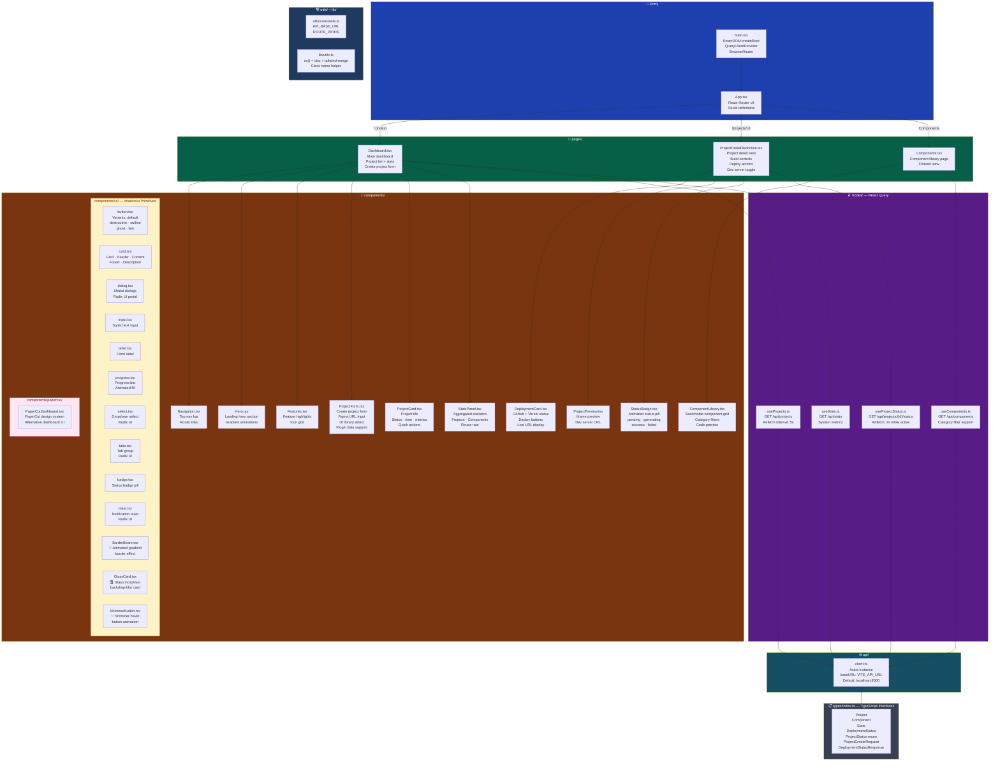

---

## 7. MCP Server Integration

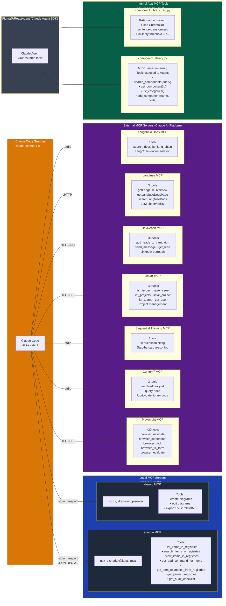

---

## 8. Database & Storage Schema

### Entity Relationship Diagram

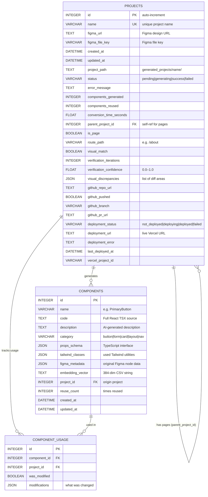

### Storage Layer Architecture

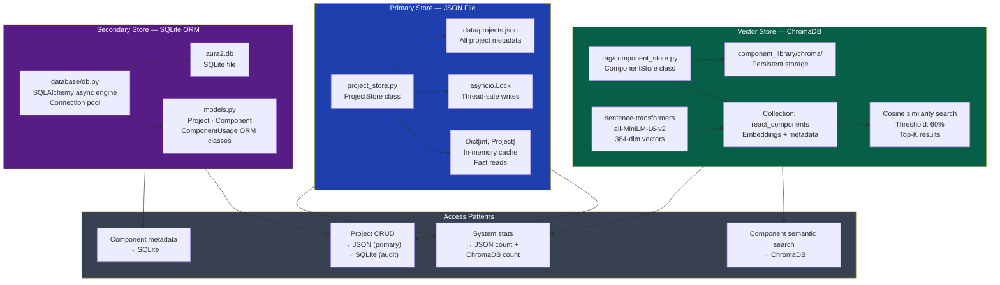

---

## 9. API Endpoints Map

```mermaid
mindmap
  root((FastAPI<br/>/api<br/>22 endpoints))
    Project Management
      POST /projects/create
        Body: ProjectCreateRequest
          figma_url
          project_name
          ui_library default=tailwind
          data_source figma_url|plugin
          plugin_data optional
          add_as new_project|new_page
          parent_project_id optional
        Returns: project_id + status
      POST /figma/plugin-upload
        Body: PluginUploadRequest
        Direct Figma plugin flow
      POST /projects/add-website
        Multi-page project support
      GET /projects
        List all projects
        Returns: projects array
      GET /projects/available
        Successful projects only
        Used for page parent selection
      GET /projects/{id}/status
        Returns: ProjectStatusResponse
          Full project details
          Deployment info
          Verification metrics
      DELETE /projects/{id}
        Delete project + files
      POST /projects/cleanup
        Remove temp files
      DELETE /projects/clear-all
        Full system reset
    Build & Preview
      GET /projects/{id}/preview-url
        Auto-starts dev server
        Returns: localhost:PORT
      POST /projects/{id}/build
        npm install + npm run build
        Returns: BuildResult
      POST /projects/{id}/start-dev-server
        Start Vite process
        Allocate port 5173+
      POST /projects/{id}/stop-dev-server
        Kill Vite process
        Free port
    Deployment
      POST /projects/{id}/push-to-github
        Create repo if needed
        Push to main branch
        Optional PR creation
        Returns: repo_url + pr_url
      POST /projects/{id}/deploy-to-vercel
        Upload to Vercel API
        Poll until deployed
        Returns: deployment_url
      GET /projects/{id}/deployment-status
        GitHub + Vercel combined status
        Returns: DeploymentStatusResponse
    Components & Stats
      GET /components
        Query: category filter
        Returns: all components
        With metadata + code
      GET /api/stats
        Total projects
        Success rate
        Components count
        Reuse rate
        Avg conversion time
    Static Files
      GET /projects/*
        StaticFiles mount
        Serve built dist/ folders
        Direct HTML access
```

---

## 10. RAG Component Reuse System

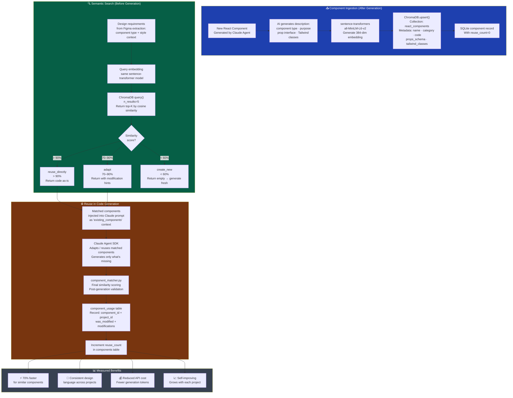

---

## 11. Visual Verification Loop

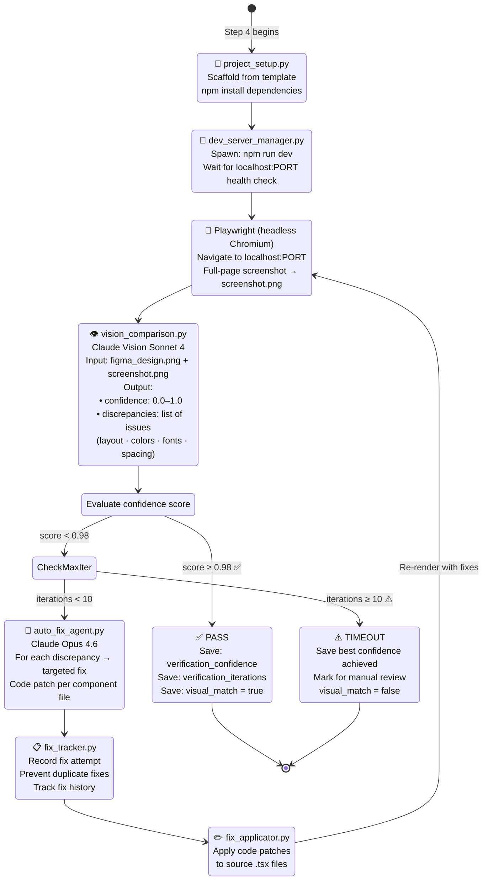

---

## 12. Deployment Pipeline

```mermaid
flowchart TB
    START(["✅ npm run build<br/>succeeded"]) --> OPTIONS

    OPTIONS["Deployment options<br/>based on env vars + user action"]

    OPTIONS --> LOCAL
    OPTIONS --> GITHUB
    OPTIONS --> VERCEL
    OPTIONS --> STATIC

    subgraph LOCAL["🖥️ Local Preview (Always Available)"]
        L1["dev_server_manager.py<br/>start_dev_server(project_id)"]
        L2["Vite: npm run dev<br/>Port range: 5173–6000"]
        L3["GET /api/projects/{id}/preview-url<br/>Returns localhost:PORT"]
        L4["ProjectPreview.tsx<br/>Iframe embed in dashboard"]
        L1 --> L2 --> L3 --> L4
    end

    subgraph STATIC["📁 Static File Serving"]
        S1["FastAPI mounts:<br/>/projects → generated_projects/"]
        S2["Serve built dist/ files<br/>Direct HTML/CSS/JS access"]
        S3["No Node.js required<br/>Pure static serving"]
        S1 --> S2 --> S3
    end

    subgraph GITHUB["🐙 GitHub Integration<br/>git_manager.py"]
        G1{"GITHUB_TOKEN<br/>set?"}
        G2["Create repository<br/>via GitHub API v3"]
        G3["git init<br/>git remote add origin"]
        G4["git add . && git commit<br/>git push origin main"]
        G5{"AUTO_CREATE_PR<br/>= true?"}
        G6["Create Pull Request<br/>title: 'Generated by Aura2'<br/>body: metrics + verification"]
        G7["Save to project:<br/>github_repo_url<br/>github_branch<br/>github_pr_url<br/>github_pushed = true"]
        G1 -- Yes --> G2 --> G3 --> G4 --> G5
        G5 -- Yes --> G6 --> G7
        G5 -- No --> G7
        G1 -- No --> SKIP_GH[Skip GitHub]
    end

    subgraph VERCEL["⬆️ Vercel Deployment"]
        V1{"VERCEL_TOKEN<br/>set?"}
        V2["POST /v13/deployments<br/>Vercel API<br/>Upload project files"]
        V3["deployment_status = 'deploying'"]
        V4["Poll /v13/deployments/{id}<br/>every 5 seconds"]
        V5{"Build<br/>succeeded?"}
        V6["Save:<br/>deployment_url<br/>vercel_project_id<br/>last_deployed_at<br/>status = 'deployed'"]
        V7["Save:<br/>deployment_error<br/>status = 'failed'"]
        V1 -- Yes --> V2 --> V3 --> V4 --> V5
        V5 -- Yes --> V6
        V5 -- No --> V7
        V1 -- No --> SKIP_V[Skip Vercel]
    end

    LOCAL --> END
    STATIC --> END
    GITHUB --> END
    VERCEL --> END

    END["📊 project_store.update_project()<br/>Final status saved<br/>Frontend polling sees update<br/>→ DeploymentCard shows URLs"]

    style START fill:#059669,color:#fff
    style END fill:#1e40af,color:#fff
    style LOCAL fill:#374151,color:#fff
    style STATIC fill:#374151,color:#fff
    style GITHUB fill:#1e3a5f,color:#fff
    style VERCEL fill:#1e40af,color:#fff
```

---

## 13. Component Relationships (Class Diagram)

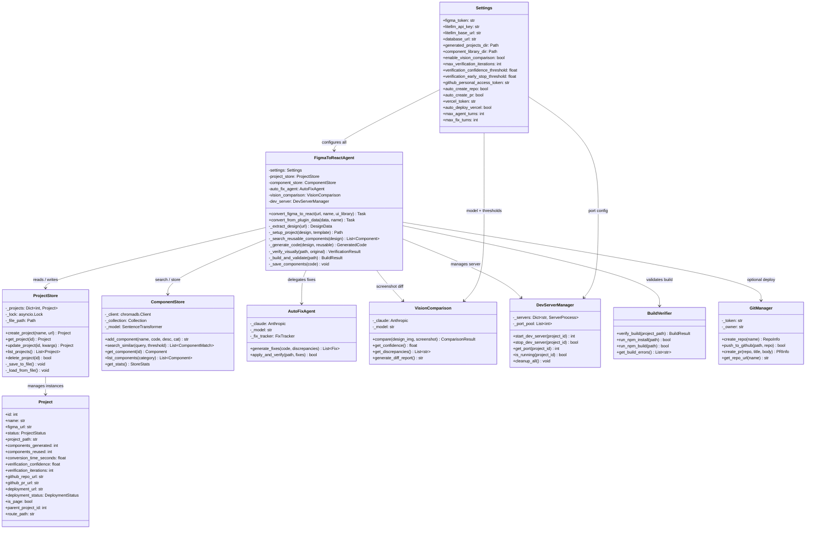

---

## 14. Full Conversion Sequence Diagram

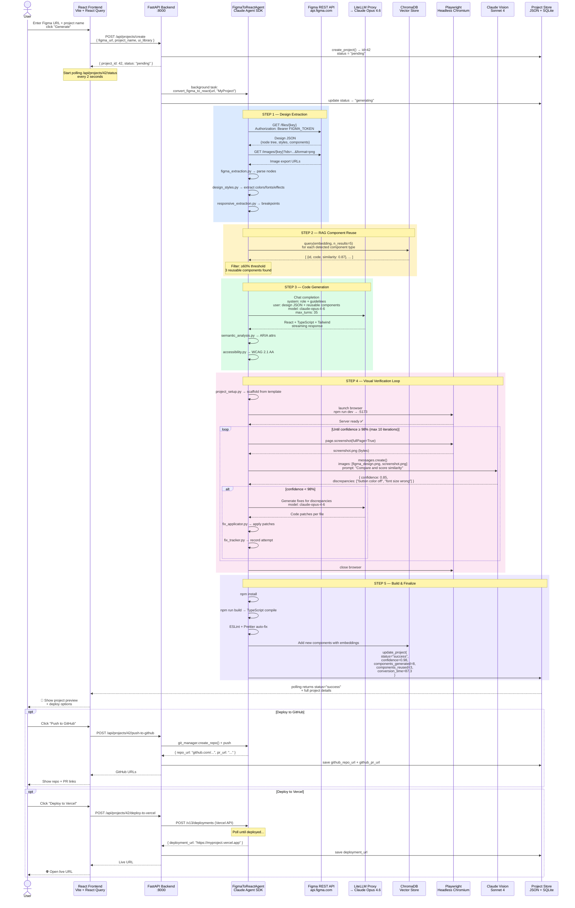

---

## 15. Performance Benchmarks

| Metric | Aura1 (LangGraph) | Aura2 (Claude SDK) | Improvement |
|--------|:-----------------:|:-------------------:|:-----------:|
| Conversion Time | 58 min | ~90 sec | **48× faster** |
| Build Success Rate | 20% | 100% | **5× better** |
| Visual Accuracy | 72% | 95% | **+32%** |
| Monthly API Cost | $2,907 | $262 | **91% cheaper** |
| Manual Fixes Needed | 80% | 5% | **94% reduction** |
| Component Reuse | 0% | ~70% | **New capability** |

```mermaid
%%{init: {'theme': 'base', 'themeVariables': {'primaryColor': '#1e40af'}}}%%
xychart-beta
    title "Aura1 vs Aura2 — Key Metrics Comparison"
    x-axis ["Build Success %", "Visual Accuracy %", "Manual Fix Rate %", "Component Reuse %"]
    y-axis "Percentage" 0 --> 100
    bar [20, 72, 80, 0]
    bar [100, 95, 5, 70]
```

---

## 16. Environment Configuration Map

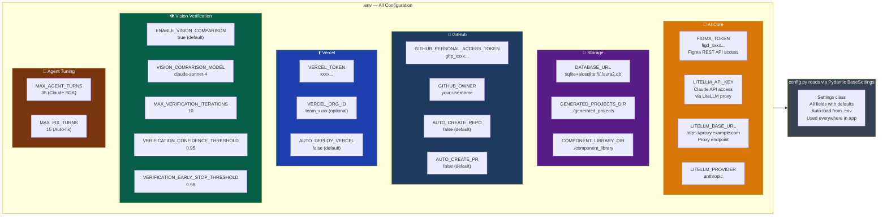

---

*Aura2 Architecture Diagrams — generated by Claude Code*
*Render with any Mermaid-compatible viewer: GitHub · VS Code (Mermaid Preview extension) · [mermaid.live](https://mermaid.live)*
