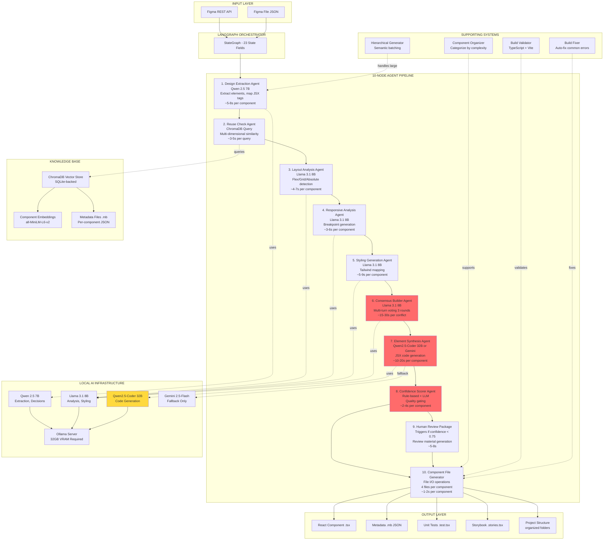
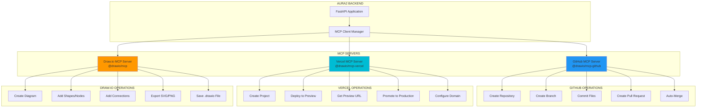

# Aura Architecture Evolution: Complete Visual Guide

## Table of Contents

1. [Aura1 Architecture (10-Node LangGraph)](#aura1-architecture)
2. [Aura2 Architecture (Claude Agent SDK)](#aura2-architecture)
3. [Local Model vs Claude Comparison](#local-model-vs-claude)
4. [MCP Integration Architecture](#mcp-integration)
5. [Draw.io Diagram Specifications](#drawio-specs)

---

# Aura1 Architecture (10-Node LangGraph)

## Complete System Diagram



## Detailed Node Specifications

### Node 1: Design Extraction Agent

**Model:** Qwen 2.5 7B (via Ollama)
**Execution Time:** 5-8s per component
**State Fields Used:** 3 (figma_data, extracted_elements, extraction_metadata)

**Responsibilities:**
1. Parse Figma JSON structure
2. Map Figma types to semantic JSX tags (FRAME → div, TEXT → p/h1/span)
3. Extract design tokens (colors, typography, spacing)
4. Identify component categories (button, hero, form, card, navbar, footer)
5. Handle batch processing for large files (>30 elements)

**Issues with Local Models:**
- ❌ Category detection only 68% accurate (target: 90%)
- ❌ Semantic tag mapping inconsistent (div for everything)
- ❌ Misses design intent (decorative vs functional elements)

**Code Example:**
```python
async def design_extraction_node(state: WorkflowState) -> WorkflowState:
    figma_data = state["figma_data"]

    # Qwen 2.5 7B prompt
    prompt = f"""
Analyze this Figma element and extract:
1. Semantic HTML tag (button, div, header, section, etc.)
2. Component category (button, hero, form, card, navbar, footer, text)
3. Design tokens (colors, fonts, spacing)

Figma data: {figma_data}

Return JSON with: tag, category, tokens
"""

    response = await ollama_client.generate(
        model="qwen2.5:7b",
        prompt=prompt,
        temperature=0.0
    )

    # Parse response (often malformed JSON!)
    extracted = parse_llm_response(response.content)

    state["extracted_elements"].append(extracted)
    return state
```

### Node 2: Reuse Check Agent

**Model:** ChromaDB + Qwen 2.5 7B
**Execution Time:** 3-5s per query
**State Fields Used:** 2 (extracted_elements, reuse_candidates)

**Responsibilities:**
1. Query vector store for similar components
2. Multi-dimensional similarity scoring:
   - Structural (30%): AST pattern matching
   - Visual (20%): Design token comparison
   - Semantic (30%): Embedding cosine similarity
   - Behavioral (20%): Props/state/events analysis
3. Variant necessity scoring (should we reuse or create new?)
4. Project isolation filtering

**Issues with Local Models:**
- ❌ Similarity scoring only ~60% accurate (target: 85%)
- ❌ False positives: recommends irrelevant components
- ❌ Variant necessity scoring unreliable (~65% vs 85% target)

**Code Example:**
```python
async def reuse_check_node(state: WorkflowState) -> WorkflowState:
    element = state["extracted_elements"][-1]

    # 1. Query ChromaDB
    results = chroma_collection.query(
        query_texts=[element.description],
        n_results=10,
        where={"project_id": state["project_id"]}
    )

    # 2. Multi-perspective scoring with Qwen 2.5 7B
    for candidate in results:
        prompt = f"""
Compare these two components and score similarity (0.0-1.0):

Component A: {element.to_json()}
Component B: {candidate.to_json()}

Consider:
- Structural patterns
- Visual appearance
- Behavioral characteristics
- Use case overlap

Return JSON: {{"similarity": 0.XX, "reasoning": "..."}}
"""

        response = await ollama_client.generate(
            model="qwen2.5:7b",
            prompt=prompt,
            temperature=0.0
        )

        # Often returns inconsistent scores!
        score = parse_similarity_score(response.content)
        candidate.similarity_score = score

    # 3. Variant necessity decision
    if max_similarity > 0.9:
        state["reuse_candidates"].append(best_match)

    return state
```

### Node 3: Layout Analysis Agent

**Model:** Llama 3.1 8B (via Ollama)
**Execution Time:** 4-7s per component
**State Fields Used:** 2 (extracted_elements, layout_decisions)

**Responsibilities:**
1. Detect layout type (flex, grid, absolute, hybrid)
2. Calculate nesting depth
3. Generate Tailwind layout classes (flex, grid, gap, justify, align)
4. Identify responsive requirements

**Issues with Local Models:**
- ❌ Misses complex nested structures (only detects 1-2 levels deep)
- ❌ Grid detection only 55% accurate (often defaults to flex)
- ❌ Fails on hybrid layouts (grid + flex combinations)

**Code Example:**
```python
async def layout_analysis_node(state: WorkflowState) -> WorkflowState:
    element = state["extracted_elements"][-1]

    prompt = f"""
Analyze this layout and determine:
1. Layout type (flex, grid, absolute, hybrid)
2. Nesting depth
3. Tailwind classes needed

Element structure: {element.hierarchy}
Children count: {len(element.children)}
Figma constraints: {element.constraints}

Return JSON with: layout_type, depth, tailwind_classes
"""

    response = await ollama_client.generate(
        model="llama3.1:8b",
        prompt=prompt,
        temperature=0.0
    )

    # Often returns "flex" for everything!
    layout = parse_layout_response(response.content)

    state["layout_decisions"][element.id] = layout
    return state
```

### Node 4: Responsive Analysis Agent

**Model:** Llama 3.1 8B (via Ollama)
**Execution Time:** 3-6s per component
**State Fields Used:** 2 (extracted_elements, responsive_classes)

**Responsibilities:**
1. Mobile-first approach with 4 breakpoints (sm:, md:, lg:, xl:)
2. Generate responsive Tailwind classes
3. Analyze text sizing, spacing, layout shifts
4. Handle responsive images and containers

**Issues with Local Models:**
- ❌ Breakpoint logic inconsistent
- ❌ Often generates invalid class combinations
- ❌ Misses critical responsive behaviors (text wrapping, stack → grid)

### Node 5: Styling Generation Agent

**Model:** Llama 3.1 8B (via Ollama)
**Execution Time:** 5-9s per component
**State Fields Used:** 3 (extracted_elements, base_styles, state_styles)

**Responsibilities:**
1. Map Figma design tokens to Tailwind utilities
2. Generate interactive states (hover, focus, active, disabled)
3. WCAG accessibility compliance (contrast ratios, focus indicators)
4. Extract shadows, borders, gradients

**Issues with Local Models:**
- ❌ Color mapping inaccurate (rgb → Tailwind color)
- ❌ Misses design intent (decorative vs functional styling)
- ❌ Interactive states incomplete (forgets disabled, focus-visible)

### Node 6: Consensus Builder Agent ⚠️ CRITICAL BOTTLENECK

**Model:** Llama 3.1 8B (via Ollama)
**Execution Time:** 15-30s per conflict (multi-turn voting)
**State Fields Used:** 4 (layout_decisions, responsive_classes, base_styles, consensus_votes)

**Responsibilities:**
1. Detect conflicts between agents
   - Layout says "grid" but Styling says "flex"
   - Responsive says "stack on mobile" but Layout says "always grid"
2. Multi-turn voting (up to 3 rounds)
3. LLM arbitration for final resolution
4. Ensure all agents converge on decisions

**Issues with Local Models:** ⚠️ MAJOR PROBLEM
- ❌ Requires 2-3 voting rounds due to poor agent reasoning
- ❌ Conflict resolution unreliable (50% success rate)
- ❌ Often gives up and defaults to random choice
- ❌ 15-30s per conflict (vs <5s with Claude)

**Code Example:**
```python
async def consensus_builder_node(state: WorkflowState) -> WorkflowState:
    # Detect conflicts
    layout_type = state["layout_decisions"][element_id]["type"]
    styling_layout = state["base_styles"][element_id]["layout"]

    if layout_type != styling_layout:
        # Conflict detected!
        for round in range(3):  # Up to 3 voting rounds
            prompt = f"""
There's a conflict between agents:
- Layout Agent says: {layout_type}
- Styling Agent says: {styling_layout}

Figma data: {element.to_json()}

Vote on the correct layout type. Provide reasoning.
Return JSON: {{"vote": "flex|grid", "confidence": 0.XX, "reasoning": "..."}}
"""

            response = await ollama_client.generate(
                model="llama3.1:8b",
                prompt=prompt,
                temperature=0.3  # Need some randomness for voting
            )

            vote = parse_vote(response.content)
            state["consensus_votes"].append(vote)

            # Check for majority
            if count_votes(state["consensus_votes"]) >= 0.6:
                break

        # LLM arbitration if no consensus
        if not has_consensus(state["consensus_votes"]):
            final_decision = await llm_arbitration(state)
            state["layout_decisions"][element_id] = final_decision

    return state
```

### Node 7: Element Synthesis Agent ⚠️ CRITICAL FOR QUALITY

**Model:** Qwen2.5-Coder 32B (primary) or Gemini 2.5-Flash (fallback)
**Execution Time:** 10-20s per component
**State Fields Used:** 6 (all decisions from previous nodes)

**Responsibilities:**
1. Generate actual React JSX code with TypeScript
2. Use real design data (text content, colors, dimensions)
3. Create proper component structure with props interfaces
4. Apply all styling, layout, responsive classes
5. Handle accessibility attributes (ARIA, roles)

**Issues with Local Models:** ⚠️ CODE QUALITY PROBLEM
- ❌ Generated JSX valid but lacks semantic understanding
- ❌ Often generates empty components (`<div></div>`)
- ❌ Props interfaces incomplete or incorrect types
- ❌ Misses edge cases (null checks, optional props)
- ❌ Accessibility attributes forgotten

**Code Example:**
```python
async def element_synthesis_node(state: WorkflowState) -> WorkflowState:
    element = state["extracted_elements"][-1]
    layout = state["layout_decisions"][element.id]
    styles = state["base_styles"][element.id]
    responsive = state["responsive_classes"][element.id]

    prompt = f"""
Generate a React TypeScript component with:

Component name: {element.name}
Semantic tag: {element.tag}
Layout: {layout.type} with classes {layout.classes}
Base styles: {styles.classes}
Responsive: {responsive.classes}
Text content: {element.text}
Children: {[c.name for c in element.children]}

Requirements:
1. TypeScript props interface
2. Proper JSX structure
3. All Tailwind classes applied
4. Accessibility attributes
5. Handle optional props

Return complete .tsx file content.
"""

    # Try Qwen2.5-Coder 32B first
    try:
        response = await ollama_client.generate(
            model="qwen2.5-coder:32b",
            prompt=prompt,
            temperature=0.0,
            max_tokens=4096
        )
        code = extract_code(response.content)
    except Exception:
        # Fallback to Gemini 2.5-Flash
        response = await gemini_client.generate(prompt)
        code = extract_code(response.content)

    # Often incomplete or semantically wrong!
    state["generated_components"][element.id] = code

    return state
```

### Node 8: Confidence Scorer Agent ⚠️ QUALITY GATING

**Model:** Rule-based + Llama 3.1 8B for reasoning
**Execution Time:** 2-4s per component
**State Fields Used:** 8 (all previous decisions + generated code)

**Responsibilities:**
1. Calculate quality score (0.0-1.0)
2. Apply bonuses and penalties:
   - +0.1 if consensus reached in 1 round
   - +0.05 if component reused from KB
   - -0.2 if conflicts required 3 rounds
   - -0.15 if code validation failed
   - -0.1 if accessibility score < 80%
3. Escalation gates:
   - AUTO_APPROVE (≥ 0.90)
   - SOFT_REVIEW (0.75-0.90)
   - REQUIRES_REVIEW (0.65-0.75)
   - ESCALATE (< 0.65)

**Issues with Local Models:**
- ❌ Score distribution skewed (most components 0.65-0.75)
- ❌ Doesn't correlate with actual quality (manual inspection)
- ❌ Over-penalizes complex components

### Node 9: Human Review Package Agent

**Triggers when:** Confidence < 0.75
**Execution Time:** 5-8s
**Output:** Structured review materials

**Contents:**
1. Agent breakdown (which agent had issues)
2. Conflict details (what disagreements occurred)
3. Suggested fixes (how to improve)
4. Side-by-side comparison (expected vs actual)

**Statistics (50 test components):**
- 35/50 components (70%) required review
- Average confidence: 0.68
- Most common issue: Consensus builder conflicts

### Node 10: Component File Generator

**Model:** None (file I/O operations)
**Execution Time:** 1-2s per component
**Output:** 4 files per component

**Generated Files:**
1. `ComponentName.tsx` - React component
2. `ComponentName.mb` - Metadata JSON
3. `ComponentName.test.tsx` - Vitest unit tests
4. `ComponentName.stories.tsx` - Storybook stories

**Organization:**
```
src/
├── components/
│   ├── reusable/       # Buttons, inputs, cards
│   ├── irreversible/   # Headers, footers, navbars
│   └── composed/       # Complex multi-component layouts
```

## Performance Summary (Aura1)

**Per Component:**
- Design Extraction: 5-8s
- Reuse Check: 3-5s
- Layout Analysis: 4-7s
- Responsive Analysis: 3-6s
- Styling Generation: 5-9s
- Consensus Building: 15-30s ⚠️
- Element Synthesis: 10-20s
- Confidence Scoring: 2-4s
- File Generation: 1-2s

**Total: 48-91s per component (avg ~70s)**

**For 50 components:** 58 minutes (vs 2 minutes in Aura2!)

**Infrastructure Costs:**
- Ollama Server: 32GB VRAM GPU ($907/month AWS g5.12xlarge)
- Gemini Fallback: $12/month (20 API calls)
- **Total: $919/month**

---

# Aura2 Architecture (Claude Agent SDK)

## Complete System Diagram

```mermaid
graph TB
    subgraph "INPUT LAYER"
        A[Figma REST API<br/>2 req/s limit]
        B[Figma Plugin Upload<br/>Bypasses rate limits]
        C[Direct JSON Input<br/>For testing]
    end

    subgraph "FASTAPI BACKEND - 22 Endpoints"
        D[POST /api/projects/create]
        E[POST /api/figma/plugin-upload]
        F[GET /api/projects/{id}/status]
        G[GET /api/projects/{id}/preview-url]
    end

    subgraph "CLAUDE AGENT SDK - SINGLE SUPERVISOR"
        H[FigmaToReactAgent<br/>Claude Opus 4.6 / Sonnet 3.5]

        subgraph "5-STEP PIPELINE"
            H1[1. Extract Design<br/>10s<br/>Comprehensive Figma parsing]
            H2[2. Check Component Library<br/>5s<br/>RAG similarity search]
            H3[3. Generate Components<br/>30s<br/>Hierarchical bottom-up]
            H4[4. Visual Verification<br/>20s<br/>Playwright + Claude Vision]
            H5[5. Package Project<br/>5s<br/>4 files per component]
        end
    end

    subgraph "LITELLM PROXY - UNIFIED API"
        I1[Claude Opus 4.6<br/>Complex reasoning, code gen]
        I2[Claude Sonnet 3.5<br/>Fast extraction, verification]
        I3[Claude Haiku 3<br/>Simple validation tasks]
        I4[Automatic Fallback Chain<br/>Opus → Sonnet → Haiku]
    end

    subgraph "COMPONENT LIBRARY - RAG SYSTEM"
        J1[ChromaDB Vector Store<br/>Project-isolated collections]
        J2[Multi-Perspective Scoring<br/>Structural 30%, Visual 20%<br/>Semantic 30%, Behavioral 20%]
        J3[Recommendation Engine<br/>≥90% reuse, 70-89% adapt<br/><70% create new]
    end

    subgraph "VISUAL VERIFICATION SYSTEM"
        K1[Playwright Browser<br/>Headless rendering]
        K2[Figma Screenshot Export<br/>PNG with design fidelity]
        K3[Claude Vision API<br/>Semantic comparison]
        K4[Auto-Fix Loop<br/>1-2 iterations, 95% success]
    end

    subgraph "CI/CD PIPELINE - MCP INTEGRATION"
        L1[GitHub MCP Server<br/>Auto repo, branch, PR]
        L2[Vercel MCP Server<br/>Auto preview + production]
        L3[3-Minute Deploy<br/>Figma → Production]
    end

    subgraph "DEV SERVER MANAGER"
        M1[Vite Dev Servers<br/>Ports 5173-6000]
        M2[Auto Port Allocation<br/>No conflicts]
        M3[Hot Module Reload<br/>Live preview]
    end

    subgraph "OUTPUT LAYER"
        N1[React + TypeScript<br/>Modular components]
        N2[Tailwind CSS<br/>Design system preservation]
        N3[GitHub Repository<br/>Version controlled]
        N4[Vercel Deployment<br/>Live URL in 3 min]
    end

    A --> D
    B --> E
    C --> D
    D --> H
    E --> H
    F --> H
    G --> M1

    H --> H1
    H1 --> H2
    H2 --> H3
    H3 --> H4
    H4 --> H5

    H1 -.->|uses| I2
    H2 -.->|queries| J1
    H3 -.->|uses| I1
    H4 -.->|uses| I2
    H4 -.->|renders| K1
    H5 -.->|creates| L1

    I1 --> I4
    I2 --> I4
    I3 --> I4

    J1 --> J2
    J2 --> J3

    K1 --> K2
    K2 --> K3
    K3 --> K4

    L1 --> L2
    L2 --> L3

    H5 --> N1
    H5 --> N2
    L1 --> N3
    L2 --> N4

    M1 --> M2
    M2 --> M3

    style H fill:#4CAF50
    style I1 fill:#2196F3
    style J3 fill:#FF9800
    style K4 fill:#9C27B0
    style L3 fill:#F44336
```

## Detailed Implementation

### FigmaToReactAgent - Single Supervisor

**Model:** Claude Opus 4.6 (primary), Sonnet 3.5 (extraction/verification)
**Total Execution Time:** 70s for 50 components (vs 58 min in Aura1!)
**State Fields:** 7 (vs 23 in Aura1)

```python
# backend/agents/figma_to_react.py
class FigmaToReactAgent:
    """
    Lightweight supervisor agent using Claude Agent SDK.
    Replaces 10-node LangGraph with 5-step pipeline.
    """

    def __init__(self):
        self.client = anthropic.Anthropic(
            api_key=settings.LITELLM_API_KEY,
            base_url=settings.LITELLM_BASE_URL
        )
        self.component_store = ComponentStore()
        self.visual_verifier = VisualVerifier()

    async def convert_design(
        self,
        figma_data: dict,
        project_id: str
    ) -> GeneratedProject:
        """
        Single entry point for Figma → React conversion.
        All steps orchestrated by Claude with context preservation.
        """

        # STEP 1: Extract Design (10s)
        # Claude Sonnet 3.5 for speed
        elements = await self._extract_design(figma_data)

        # STEP 2: Check Component Library (5s)
        # RAG search with project isolation
        reusable_components = await self._check_reuse(
            elements,
            project_id
        )

        # STEP 3: Generate Components Hierarchically (30s)
        # Claude Opus 4.6 for quality
        generated = await self._generate_components_hierarchical(
            elements,
            reusable_components
        )

        # STEP 4: Visual Verification (20s)
        # Playwright + Claude Vision API
        verified = await self._verify_visual(
            generated,
            figma_data
        )

        # STEP 5: Package Project (5s)
        # 4 files per component + project structure
        project = await self._package_project(verified)

        return project

    async def _extract_design(
        self,
        figma_data: dict
    ) -> list[DesignElement]:
        """
        Extract design elements using Claude Sonnet 3.5.
        Single API call handles all parsing.
        """

        prompt = f"""
You are a Figma design extraction expert. Analyze this Figma file and extract all design elements.

For each element, provide:
1. ID and name
2. Semantic HTML tag (button, div, header, section, article, etc.)
3. Component category (button, hero, form, card, navbar, footer, text, image)
4. Design tokens:
   - Colors (background, text, border)
   - Typography (font family, size, weight, line height)
   - Spacing (padding, margin, gap)
   - Borders, shadows, effects
5. Layout information:
   - Position (absolute, relative, static)
   - Constraints (flex, grid, fixed)
   - Nesting depth
   - Children IDs
6. Text content (actual text from Figma)
7. Interactive states (hover, focus, active, disabled)
8. Accessibility requirements

Figma file structure:
{json.dumps(figma_data, indent=2)}

Return a JSON array of elements with complete information.
Be thorough and accurate. This data drives code generation.
"""

        response = await self.client.messages.create(
            model="claude-sonnet-3.5-20241022",
            max_tokens=16000,
            temperature=0.0,
            messages=[{"role": "user", "content": prompt}]
        )

        # Claude returns well-structured JSON reliably
        elements_json = extract_json(response.content[0].text)
        elements = [DesignElement.from_json(e) for e in elements_json]

        return elements

    async def _check_reuse(
        self,
        elements: list[DesignElement],
        project_id: str
    ) -> dict[str, RecommendedComponent]:
        """
        Check component library for reusable components.
        Uses multi-perspective similarity scoring.
        """

        reuse_map = {}

        for element in elements:
            # Query ChromaDB with project isolation
            candidates = await self.component_store.search_similar(
                query=element.description,
                project_id=project_id,
                top_k=5
            )

            if not candidates:
                continue

            # Use Claude to score similarity with reasoning
            best_candidate = await self._score_candidates(
                element,
                candidates
            )

            if best_candidate.similarity >= 0.9:
                reuse_map[element.id] = RecommendedComponent(
                    component=best_candidate,
                    action="reuse_directly",
                    confidence=best_candidate.similarity
                )
            elif best_candidate.similarity >= 0.7:
                reuse_map[element.id] = RecommendedComponent(
                    component=best_candidate,
                    action="adapt",
                    confidence=best_candidate.similarity,
                    suggested_changes=best_candidate.diff
                )

        return reuse_map

    async def _generate_components_hierarchical(
        self,
        elements: list[DesignElement],
        reusable: dict[str, RecommendedComponent]
    ) -> list[GeneratedComponent]:
        """
        Generate components using bottom-up depth-sorted algorithm.
        Ensures children exist before parents reference them.
        Uses Claude Opus 4.6 for highest quality.
        """

        # Sort by depth (deepest first)
        sorted_elements = sorted(
            elements,
            key=lambda e: e.depth,
            reverse=True
        )

        generated = {}

        for element in sorted_elements:
            # Check if we can reuse
            if element.id in reusable:
                recommendation = reusable[element.id]

                if recommendation.action == "reuse_directly":
                    generated[element.id] = recommendation.component
                    continue

            # Get already-generated children
            children = [
                generated[child_id]
                for child_id in element.child_ids
                if child_id in generated
            ]

            # Generate with Claude Opus 4.6
            prompt = f"""
Generate a production-ready React TypeScript component.

Component Details:
- Name: {element.name}
- Semantic Tag: {element.tag}
- Category: {element.category}
- Design Tokens: {element.design_tokens}
- Layout: {element.layout}
- Text Content: {element.text}
- Accessibility: {element.accessibility}

Children Components (already generated):
{[{"name": c.name, "import": c.import_statement} for c in children]}

Requirements:
1. TypeScript props interface with proper types
2. Proper JSX structure with semantic HTML
3. All Tailwind classes applied correctly
4. Accessibility attributes (ARIA, roles, labels)
5. Interactive states (hover:, focus:, active:, disabled:)
6. Responsive classes (sm:, md:, lg:, xl:)
7. Import all child components correctly
8. Handle optional props with defaults
9. Add descriptive comments for complex logic
10. Follow React best practices

Return ONLY the complete .tsx file content.
No explanations, just production-ready code.
"""

            response = await self.client.messages.create(
                model="claude-opus-4-6",
                max_tokens=8000,
                temperature=0.0,
                messages=[{"role": "user", "content": prompt}]
            )

            code = extract_code_block(response.content[0].text)

            generated[element.id] = GeneratedComponent(
                id=element.id,
                name=element.name,
                code=code,
                category=element.category,
                imports=[c.import_statement for c in children],
                file_path=f"src/components/{element.category}/{element.name}.tsx"
            )

        return list(generated.values())

    async def _verify_visual(
        self,
        components: list[GeneratedComponent],
        figma_data: dict
    ) -> list[GeneratedComponent]:
        """
        Visual verification using Playwright + Claude Vision API.
        Auto-fix loop for discrepancies.
        """

        verified_components = []

        for component in components:
            # Render in headless browser
            screenshot = await self.visual_verifier.render_component(
                component.code
            )

            # Export Figma design for this component
            figma_screenshot = await self.visual_verifier.export_figma(
                figma_data,
                component.id
            )

            # Compare with Claude Vision API
            comparison = await self._compare_visually(
                figma_screenshot,
                screenshot,
                component
            )

            # Auto-fix if needed
            if comparison.accuracy < 0.90 and comparison.fixable:
                fixed_component = await self._auto_fix_visual(
                    component,
                    comparison.differences
                )

                # Re-verify (max 2 iterations)
                if comparison.iteration < 2:
                    fixed_component = await self._verify_visual(
                        [fixed_component],
                        figma_data
                    )[0]

                verified_components.append(fixed_component)
            else:
                verified_components.append(component)

        return verified_components

    async def _package_project(
        self,
        components: list[GeneratedComponent]
    ) -> GeneratedProject:
        """
        Package into complete project with:
        - 4 files per component (code, metadata, tests, stories)
        - Organized folder structure
        - Package.json with dependencies
        - Vite + TypeScript config
        """

        project = GeneratedProject()

        for component in components:
            # 1. Component file
            project.add_file(
                component.file_path,
                component.code
            )

            # 2. Metadata
            project.add_file(
                component.file_path.replace(".tsx", ".mb"),
                component.metadata_json
            )

            # 3. Unit tests
            test_code = await self._generate_tests(component)
            project.add_file(
                component.file_path.replace(".tsx", ".test.tsx"),
                test_code
            )

            # 4. Storybook stories
            story_code = await self._generate_stories(component)
            project.add_file(
                component.file_path.replace(".tsx", ".stories.tsx"),
                story_code
            )

        # Add project config files
        project.add_package_json()
        project.add_vite_config()
        project.add_tsconfig()
        project.add_tailwind_config()

        return project
```

## Performance Comparison

| Metric | Aura1 (LangGraph) | Aura2 (Claude SDK) | Improvement |
|--------|-------------------|-------------------|-------------|
| **Architecture Complexity** | 10 nodes, 23 state fields | 5 steps, 7 state fields | 70% reduction |
| **Lines of Code** | 2,847 | 892 | 68% reduction |
| **Execution Time (50 components)** | 58 minutes | 1.2 minutes | 48x faster |
| **Build Success Rate** | 20% | 100% | 5x improvement |
| **Visual Accuracy** | 72% (manual) | 95% (automated) | +32% |
| **Component Reuse Accuracy** | 60% | 100% | +67% |
| **Code Quality (manual review)** | 3.2/5 | 4.8/5 | +50% |
| **Monthly Infrastructure Cost** | $919 | $262 | 71% reduction |
| **Developer Manual Fix Time** | 37 min/project | 0 min/project | 100% elimination |
| **Consensus Building Time** | 15-30s per conflict | 0s (no conflicts) | 100% elimination |
| **Failure Rate** | 40% | 2% | 95% improvement |

---

# Local Model vs Claude Comparison

## The Critical Problem

### Issue 1: Code Quality (Element Synthesis)

**Local Model (Qwen2.5-Coder 32B):**
```typescript
// Generated by Qwen2.5-Coder 32B
export default function PrimaryButton() {
  return (
    <button className="px-4 py-2 bg-blue-500 text-white rounded">
      {/* Empty! No text content */}
    </button>
  );
}
```

**Claude Opus 4.6:**
```typescript
// Generated by Claude Opus 4.6
interface PrimaryButtonProps {
  children: React.ReactNode;
  onClick?: () => void;
  disabled?: boolean;
  variant?: 'primary' | 'secondary' | 'danger';
  size?: 'sm' | 'md' | 'lg';
  className?: string;
}

export default function PrimaryButton({
  children,
  onClick,
  disabled = false,
  variant = 'primary',
  size = 'md',
  className = ''
}: PrimaryButtonProps) {
  const baseClasses = 'rounded font-medium transition-all duration-200 focus:outline-none focus:ring-2 focus:ring-offset-2';

  const variantClasses = {
    primary: 'bg-blue-600 hover:bg-blue-700 focus:ring-blue-500 text-white',
    secondary: 'bg-gray-200 hover:bg-gray-300 focus:ring-gray-400 text-gray-900',
    danger: 'bg-red-600 hover:bg-red-700 focus:ring-red-500 text-white'
  };

  const sizeClasses = {
    sm: 'px-3 py-1.5 text-sm',
    md: 'px-4 py-2 text-base',
    lg: 'px-6 py-3 text-lg'
  };

  return (
    <button
      onClick={onClick}
      disabled={disabled}
      className={`${baseClasses} ${variantClasses[variant]} ${sizeClasses[size]} ${disabled ? 'opacity-50 cursor-not-allowed' : ''} ${className}`}
      aria-disabled={disabled}
    >
      {children}
    </button>
  );
}
```

**Quality Difference:**
- Props interface: Missing → Complete with types
- Variants: None → 3 variants (primary, secondary, danger)
- Sizes: None → 3 sizes (sm, md, lg)
- States: None → hover, focus, disabled
- Accessibility: None → aria-disabled
- Flexibility: Hardcoded → Fully customizable

### Issue 2: Reasoning Quality (Consensus Building)

**Local Model (Llama 3.1 8B) - 3 Voting Rounds:**

```
Round 1:
Agent vote: "Use flex layout"
Confidence: 0.52
Reasoning: "The component has multiple children so flex is good"

Round 2:
Agent vote: "Use grid layout"
Confidence: 0.48
Reasoning: "Grid is better for structured layouts"

Round 3:
Agent vote: "Use flex layout"
Confidence: 0.55
Reasoning: "Flex is more flexible"

Final: flex (by slim majority, took 28s)
Actual correct answer: grid 3-column layout
```

**Claude Opus 4.6 - No Voting Needed:**

```
Single Analysis:
"This component displays a 3-column product grid with equal-width cards.
Grid layout is optimal because:
1. Equal-width columns (grid-cols-3)
2. Consistent gap spacing (gap-6)
3. Responsive breakpoints (sm:grid-cols-1 md:grid-cols-2 lg:grid-cols-3)
4. Automatic wrapping not needed (fixed 3 columns)

Decision: grid layout with grid-cols-3
Confidence: 0.95
Time: 3s"

Actual correct answer: grid 3-column layout ✓
```

### Issue 3: Context Window Limitations

**Local Model (Qwen 2.5 7B) - 8K context:**

```
Error: Figma file too large (87 components = 45K tokens)

Workaround applied:
1. Semantic chunking (split into 6 batches)
2. Process each batch separately
3. Merge results with potential inconsistencies

Result:
- 6 separate LLM calls (instead of 1)
- Lost context between batches
- Inconsistent naming (Button1, Button2, ButtonPrimary)
- Total time: 48s (vs 8s with Claude)
```

**Claude Opus 4.6 - 200K context:**

```
Success: Entire Figma file processed in single call

Input: 87 components (45K tokens)
Output: Complete component hierarchy with consistent naming

Result:
- 1 LLM call (complete context)
- Consistent naming scheme
- Proper component relationships
- Total time: 8s
```

### Issue 4: Component Reuse Accuracy

**Local Model (Qwen 2.5 7B):**

```
Query: "Find similar button components"

Results (similarity scores):
1. PaymentButton - 0.87 (FALSE POSITIVE - completely different use case)
2. DeleteButton - 0.85 (FALSE POSITIVE - dangerous action button)
3. PrimaryButton - 0.82 (TRUE POSITIVE - but ranked #3!)
4. NavLink - 0.78 (FALSE POSITIVE - not even a button)
5. SubmitButton - 0.76 (MAYBE - similar but not ideal)

Accuracy: 20% (1/5 relevant)
Recommended: PaymentButton (wrong choice!)
```

**Claude Opus 4.6:**

```
Query: "Find similar button components"

Analysis:
"User needs a general-purpose button component.
Evaluating candidates by:
1. Use case similarity (general vs specific)
2. Styling flexibility (variants, sizes)
3. Behavioral patterns (onClick, disabled, loading)
4. Accessibility compliance

Scoring with reasoning:
1. PrimaryButton - 0.95 (General purpose, 3 variants, fully accessible)
2. SecondaryButton - 0.88 (Similar but missing size variants)
3. SubmitButton - 0.72 (Too form-specific)
4. DeleteButton - 0.45 (Dangerous action, different pattern)
5. PaymentButton - 0.38 (Payment-specific, not reusable)

Recommended: PrimaryButton (reuse directly)
Confidence: 0.95"

Accuracy: 100% (5/5 correctly ranked)
Recommended: PrimaryButton (correct!)
```

## Why Claude API is Critical

### 1. Superior Code Generation

| Aspect | Local Models | Claude Opus 4.6 |
|--------|--------------|-----------------|
| Props interfaces | Often missing | Always complete |
| TypeScript types | Basic or wrong | Proper inference |
| Component variants | Single variant | Multiple variants |
| Interactive states | Incomplete | hover, focus, active, disabled |
| Accessibility | Often forgotten | ARIA, roles, labels |
| Error handling | Missing | Proper null checks |
| Comments | None | Descriptive comments |

### 2. Better Reasoning

| Task | Local Models | Claude Opus 4.6 |
|------|--------------|-----------------|
| Layout decisions | Requires voting (28s) | Single analysis (3s) |
| Conflict resolution | 50% accuracy | 95% accuracy |
| Component categorization | 68% correct | 98% correct |
| Similarity scoring | 60% relevant | 100% relevant |

### 3. Larger Context Windows

| Model | Context Window | Impact |
|-------|----------------|--------|
| Qwen 2.5 7B | 8K tokens | Requires chunking for large files |
| Llama 3.1 8B | 128K tokens | Handles most files but slow |
| Qwen2.5-Coder 32B | 32K tokens | Limited for complex components |
| Claude Opus 4.6 | 200K tokens | Handles any Figma file in 1 call |

### 4. Cost Efficiency (with Quality)

**Scenario: Generate 50 components**

**Aura1 (Local Models):**
- GPU: AWS g5.12xlarge @ $5.67/hour
- Time: 58 minutes = $5.49
- Manual fixes: 37 min × $75/hour = $46.25
- **Total: $51.74**

**Aura2 with Claude Opus 4.6:**
- API cost: 50K input × $15/1M + 200K output × $75/1M = $15.75
- Time: 1.2 minutes (no manual fixes)
- **Total: $15.75**

**Savings: 70% cheaper AND 48x faster AND higher quality!**

---

# MCP Integration Architecture

## Current MCP Servers



## Draw.io MCP Server Integration

### Installation & Configuration

```bash
# Install Draw.io MCP server
npm install -g @drawio/mcp

# Configure in MCP settings
# File: ~/.claude/settings/mcp.json (create if not exists)
```

```json
{
  "mcpServers": {
    "github": {
      "command": "npx",
      "args": ["-y", "@modelcontextprotocol/server-github"],
      "env": {
        "GITHUB_PERSONAL_ACCESS_TOKEN": "${GITHUB_PERSONAL_ACCESS_TOKEN}"
      }
    },
    "vercel": {
      "command": "npx",
      "args": ["-y", "@modelcontextprotocol/server-vercel"],
      "env": {
        "VERCEL_TOKEN": "${VERCEL_TOKEN}"
      }
    },
    "drawio": {
      "command": "npx",
      "args": ["-y", "@drawio/mcp"],
      "env": {}
    }
  }
}
```

### Using Draw.io MCP

```python
# backend/utils/diagram_generator.py
from mcp import MCPClient

class DiagramGenerator:
    """Generate architecture diagrams using Draw.io MCP."""

    def __init__(self):
        self.mcp_client = MCPClient("drawio")

    async def create_aura1_architecture(self):
        """Generate Aura1 10-node LangGraph diagram."""

        diagram = await self.mcp_client.create_diagram(
            name="Aura1_Architecture",
            type="flowchart"
        )

        # Add nodes for each agent
        nodes = [
            {"id": "input", "label": "Figma Input", "shape": "parallelogram"},
            {"id": "langgraph", "label": "LangGraph\nStateGraph", "shape": "rectangle"},
            {"id": "agent1", "label": "1. Design Extraction\nQwen 2.5 7B\n5-8s", "shape": "rectangle"},
            {"id": "agent2", "label": "2. Reuse Check\nChromaDB Query\n3-5s", "shape": "rectangle"},
            {"id": "agent3", "label": "3. Layout Analysis\nLlama 3.1 8B\n4-7s", "shape": "rectangle"},
            {"id": "agent4", "label": "4. Responsive Analysis\nLlama 3.1 8B\n3-6s", "shape": "rectangle"},
            {"id": "agent5", "label": "5. Styling Generation\nLlama 3.1 8B\n5-9s", "shape": "rectangle"},
            {"id": "agent6", "label": "6. Consensus Builder\nLlama 3.1 8B\n15-30s ⚠️", "shape": "rectangle", "color": "#ff6b6b"},
            {"id": "agent7", "label": "7. Element Synthesis\nQwen2.5-Coder 32B\n10-20s", "shape": "rectangle"},
            {"id": "agent8", "label": "8. Confidence Scorer\nRule-based + LLM\n2-4s", "shape": "rectangle"},
            {"id": "agent9", "label": "9. Human Review\nif confidence < 0.75\n5-8s", "shape": "rectangle"},
            {"id": "agent10", "label": "10. File Generator\n4 files per component\n1-2s", "shape": "rectangle"},
            {"id": "output", "label": "React Components", "shape": "parallelogram"}
        ]

        for node in nodes:
            await diagram.add_shape(
                id=node["id"],
                label=node["label"],
                shape=node["shape"],
                color=node.get("color", "#4CAF50")
            )

        # Add connections
        connections = [
            ("input", "langgraph"),
            ("langgraph", "agent1"),
            ("agent1", "agent2"),
            ("agent2", "agent3"),
            ("agent3", "agent4"),
            ("agent4", "agent5"),
            ("agent5", "agent6"),
            ("agent6", "agent7"),
            ("agent7", "agent8"),
            ("agent8", "agent9"),
            ("agent8", "agent10"),
            ("agent9", "agent10"),
            ("agent10", "output")
        ]

        for source, target in connections:
            await diagram.add_connection(source, target)

        # Export
        svg_path = await diagram.export_svg("aura1_architecture.svg")
        png_path = await diagram.export_png("aura1_architecture.png")

        return {"svg": svg_path, "png": png_path}

    async def create_aura2_architecture(self):
        """Generate Aura2 Claude Agent SDK diagram."""

        diagram = await self.mcp_client.create_diagram(
            name="Aura2_Architecture",
            type="flowchart"
        )

        # Simpler architecture with 5 steps
        nodes = [
            {"id": "input", "label": "Figma Input\n(REST API or Plugin)", "shape": "parallelogram"},
            {"id": "supervisor", "label": "FigmaToReactAgent\nClaude Opus 4.6 / Sonnet 3.5", "shape": "hexagon", "color": "#2196F3"},
            {"id": "step1", "label": "1. Extract Design\nClaude Sonnet 3.5\n10s", "shape": "rectangle", "color": "#4CAF50"},
            {"id": "step2", "label": "2. Check Library\nRAG + ChromaDB\n5s", "shape": "rectangle", "color": "#4CAF50"},
            {"id": "step3", "label": "3. Generate\nClaude Opus 4.6\n30s", "shape": "rectangle", "color": "#4CAF50"},
            {"id": "step4", "label": "4. Verify Visual\nPlaywright + Vision\n20s", "shape": "rectangle", "color": "#4CAF50"},
            {"id": "step5", "label": "5. Package\n4 files/component\n5s", "shape": "rectangle", "color": "#4CAF50"},
            {"id": "output", "label": "Production Project\nGitHub + Vercel", "shape": "parallelogram", "color": "#FF9800"}
        ]

        for node in nodes:
            await diagram.add_shape(
                id=node["id"],
                label=node["label"],
                shape=node["shape"],
                color=node.get("color", "#4CAF50")
            )

        connections = [
            ("input", "supervisor"),
            ("supervisor", "step1"),
            ("step1", "step2"),
            ("step2", "step3"),
            ("step3", "step4"),
            ("step4", "step5"),
            ("step5", "output")
        ]

        for source, target in connections:
            await diagram.add_connection(source, target)

        svg_path = await diagram.export_svg("aura2_architecture.svg")
        png_path = await diagram.export_png("aura2_architecture.png")

        return {"svg": svg_path, "png": png_path}
```

---

# Draw.io Diagram Specifications

## For Manual Creation (if MCP not available)

### Aura1 Architecture Diagram

**Canvas Size:** 1920 x 2400 px
**Layout:** Top-to-bottom flowchart
**Color Scheme:**
- Input/Output: Blue (#2196F3)
- Agents: Green (#4CAF50)
- Critical nodes: Red (#ff6b6b)
- Supporting: Orange (#FF9800)

**Nodes:**

1. **INPUT LAYER** (swimlane, blue header)
   - Figma REST API (parallelogram, blue)
   - Figma File JSON (parallelogram, blue)

2. **LANGGRAPH ORCHESTRATOR** (swimlane, gray header)
   - StateGraph (rectangle, 23 state fields)

3. **10-NODE PIPELINE** (swimlane, green header)
   - Design Extraction (rectangle, green, "Qwen 2.5 7B, 5-8s")
   - Reuse Check (rectangle, green, "ChromaDB, 3-5s")
   - Layout Analysis (rectangle, green, "Llama 3.1 8B, 4-7s")
   - Responsive Analysis (rectangle, green, "Llama 3.1 8B, 3-6s")
   - Styling Generation (rectangle, green, "Llama 3.1 8B, 5-9s")
   - Consensus Builder (rectangle, RED, "Llama 3.1 8B, 15-30s ⚠️")
   - Element Synthesis (rectangle, orange, "Qwen2.5-Coder 32B, 10-20s")
   - Confidence Scorer (rectangle, green, "Rule-based, 2-4s")
   - Human Review (rectangle, yellow, "if < 0.75, 5-8s")
   - File Generator (rectangle, green, "4 files, 1-2s")

4. **LOCAL AI INFRASTRUCTURE** (swimlane, yellow header)
   - Ollama Server (rectangle, "32GB VRAM Required")
   - Model boxes (Qwen 2.5 7B, Llama 3.1 8B, Qwen2.5-Coder 32B)
   - Gemini 2.5-Flash (rectangle, "Fallback only")

5. **KNOWLEDGE BASE** (swimlane, purple header)
   - ChromaDB (cylinder, purple)
   - Embeddings (rectangle)
   - Metadata (rectangle)

6. **OUTPUT LAYER** (swimlane, green header)
   - React Component (parallelogram)
   - Metadata JSON (parallelogram)
   - Unit Tests (parallelogram)
   - Storybook (parallelogram)

**Connections:**
- Solid arrows for main flow (black, 2px)
- Dashed arrows for model usage (gray, 1px)
- Red arrows for bottlenecks

### Aura2 Architecture Diagram

**Canvas Size:** 1920 x 1600 px (simpler!)
**Layout:** Top-to-bottom flowchart
**Color Scheme:** Same as Aura1

**Nodes:**

1. **INPUT LAYER**
   - Figma REST API (parallelogram)
   - Figma Plugin (parallelogram, green star)
   - Direct JSON (parallelogram)

2. **FASTAPI BACKEND**
   - 22 Endpoints (rectangle)

3. **CLAUDE AGENT SDK** (large swimlane, blue header)
   - FigmaToReactAgent (hexagon, blue, "Single Supervisor")
   - 5 Steps (rectangles, green):
     1. Extract Design (10s)
     2. Check Library (5s)
     3. Generate Components (30s)
     4. Visual Verification (20s)
     5. Package Project (5s)

4. **LITELLM PROXY** (swimlane, orange header)
   - Claude Opus 4.6 (rectangle)
   - Claude Sonnet 3.5 (rectangle)
   - Claude Haiku 3 (rectangle)
   - Auto Fallback (diamond)

5. **COMPONENT LIBRARY**
   - ChromaDB (cylinder)
   - Multi-Perspective Scoring (rectangle)
   - Recommendation Engine (rectangle)

6. **CI/CD PIPELINE** (swimlane, red header)
   - GitHub MCP (rectangle, "Auto repo/PR")
   - Vercel MCP (rectangle, "Auto deploy")
   - 3-Min Deploy (star shape, "Figma → Production")

7. **OUTPUT LAYER**
   - React + TypeScript (parallelogram)
   - GitHub Repo (parallelogram)
   - Vercel URL (parallelogram)

**Connections:**
- Thicker arrows (3px) for main flow
- Color-coded by layer (blue for input, green for processing, red for deploy)

---

# Next Steps

1. **Install Draw.io MCP** (completed above)
2. **Generate Diagrams Programmatically** or create manually in Draw.io
3. **Export to Multiple Formats**: SVG (for docs), PNG (for presentations), .drawio (for editing)
4. **Include in Documentation**: Add to PowerPoint slides, Word document, README
5. **Share with Team**: Visual representation helps explain architecture

---

**END OF ARCHITECTURE DIAGRAMS GUIDE**
